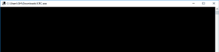

# Cyclic Redundancy Checker 

The program is an error detctor mechanism using the standard CRC algorithm

It Contains 
- Generator
- Verifier
- Alter 

## How to use this program :

1. Download the CRC.exe file
2. Download the Message.txt file
3. Run the executable file 

Command Window will appear 

4. Now you have to choose between two commands:
  - generator < filepath | verifier 
  
  
  
  or 
  
  - generator < filepath | alter arg verifier 
  
  
  
 ###### Running Test Cases 
 
 
 
  
  

